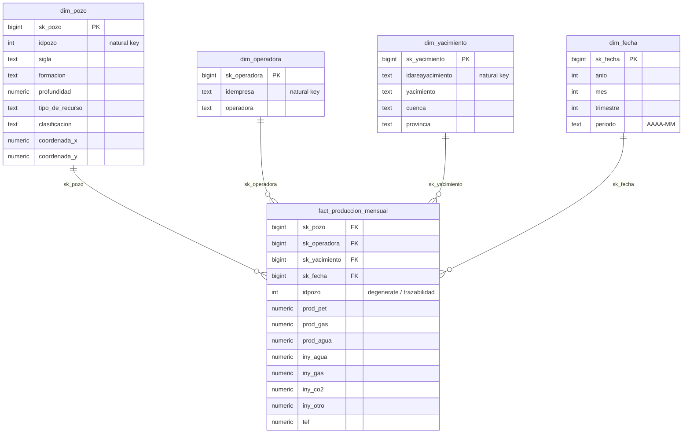

# Modelo de datos — Data Warehouse (capa Gold)

Documento de referencia del modelo dimensional servido en la capa **Gold** del
Data Warehouse (PostgreSQL). Define el **grano de la fact table**, las
**dimensiones**, las **surrogate keys** y la **decisión de SCD**.

- Decisiones de diseño y alternativas comparadas: [ADR-014 (Medallion)](adr/0014-arquitectura-medallion.md),
  [ADR-015 (modelo estrella)](adr/0015-modelo-dimensional-estrella.md),
  [ADR-016 (Data Quality)](adr/0016-estrategia-data-quality.md).
- Fuentes y contrato de entrada (capa Bronze): ver `data_pipeline/README.md`.

---

## 1. Arquitectura de capas (resumen)

```
Bronze (parquet, crudo)  →  Silver (limpio, tipado)  →  Gold (modelo estrella)
   dueño: Data Engineer       dueño: Analytics Eng.       dueño: Analytics Eng.
```

- **Bronze**: crudo de datos.gob.ar, parquet particionado por `anio/mes`, inmutable.
- **Silver**: una fila limpia por registro de origen (casteo de tipos, deduplicación,
  normalización de nombres, manejo de nulos). Sobre Silver corre el gate de calidad (ADR-016).
- **Gold**: esquema estrella consumido por BI (Metabase), gobierno (DataHub) y la API.

Esquemas en Postgres: `silver`, `gold`, `dq` (resultados de calidad).

---

## 2. Diagrama del modelo estrella



---

## 3. Fact table: `gold.fact_produccion_mensual`

- **Grano:** una fila por **`(pozo, mes)`** → clave de negocio `idpozo + anio + mes`.
  Es el grano nativo de la fuente de producción (no hay grano diario).
- **Tipo de fact:** transaccional periódica (snapshot mensual de producción/inyección).
- **Fuente:** `silver.produccion` (derivada de Bronze producción no convencional).

### Claves foráneas (a las dimensiones)

| Columna | Refiere a | Origen |
|---|---|---|
| `sk_pozo` | `dim_pozo` | resuelta por `idpozo` |
| `sk_operadora` | `dim_operadora` | resuelta por `idempresa` **del mes** (captura la relación pozo→operadora vigente) |
| `sk_yacimiento` | `dim_yacimiento` | resuelta por `idareayacimiento` |
| `sk_fecha` | `dim_fecha` | resuelta por `(anio, mes)` |

> `idpozo` se conserva además como **dimensión degenerada** en la fact para trazabilidad
> directa contra Bronze/Silver sin join.

### Medidas

| Medida | Tipo | Aditividad | Descripción |
|---|---|---|---|
| `prod_pet` | numeric | aditiva | Producción de petróleo del mes |
| `prod_gas` | numeric | aditiva | Producción de gas del mes |
| `prod_agua` | numeric | aditiva | Producción de agua del mes |
| `iny_agua` | numeric | aditiva | Inyección de agua |
| `iny_gas` | numeric | aditiva | Inyección de gas |
| `iny_co2` | numeric | aditiva | Inyección de CO₂ |
| `iny_otro` | numeric | aditiva | Inyección de otros |
| `tef` | numeric | **no aditiva** | Tiempo efectivo de producción (días/horas del mes); promediar, no sumar |

Las medidas aditivas pueden sumarse libremente por cualquier dimensión (pozo, operadora,
yacimiento, tiempo). `tef` no se suma entre meses: se promedia o se usa como contexto.

---

## 4. Dimensiones

### 4.1 `gold.dim_pozo` — **SCD Type 1**

- **Clave natural:** `idpozo` · **Surrogate key:** `sk_pozo`
- **Fuente:** `silver.pozos` (catálogo) enriquecido con atributos de producción cuando falten.

| Atributo | Origen | Notas |
|---|---|---|
| `sigla` | `sigla` | identificador legible del pozo |
| `formacion` | `formacion` / `formprod` | formación productiva |
| `profundidad` | `profundidad` | metros |
| `tipo_de_recurso` | `tipo_de_recurso` | p. ej. TIGHT, SHALE (no convencional) |
| `clasificacion` | `clasificacion` | EXPLOTACION / EXPLORACION |
| `coordenada_x`, `coordenada_y` | `coordenadax`, `coordenaday` | ubicación |

### 4.2 `gold.dim_operadora` — **SCD Type 1**

- **Clave natural:** `idempresa` · **Surrogate key:** `sk_operadora`
- **Fuente:** distinct de `(idempresa, empresa)` en `silver.produccion` / `silver.pozos`.

| Atributo | Origen | Notas |
|---|---|---|
| `operadora` | `empresa` | razón social **normalizada** (trim, mayúsculas consistentes) |

### 4.3 `gold.dim_yacimiento` — SCD Type 1

- **Clave natural:** `idareayacimiento` · **Surrogate key:** `sk_yacimiento`

| Atributo | Origen | Notas |
|---|---|---|
| `yacimiento` | `areayacimiento` | nombre del área/yacimiento |
| `cuenca` | `cuenca` | p. ej. NEUQUINA |
| `provincia` | `provincia` | normalizada (p. ej. "Neuquén") |

### 4.4 `gold.dim_fecha` — generada

- **Clave natural:** `(anio, mes)` · **Surrogate key:** `sk_fecha`
- **Grano:** mensual (no hay día en la fuente). Se genera por el rango de fechas presente en producción.

| Atributo | Descripción |
|---|---|
| `anio` | año |
| `mes` | mes (1–12) |
| `trimestre` | 1–4 derivado del mes |
| `periodo` | etiqueta `AAAA-MM` para ejes de dashboards |

---

## 5. Surrogate keys

- Toda dimensión usa una **surrogate key entera** (`sk_*`), no la clave natural de la fuente.
  Se genera con `dbt_utils.generate_surrogate_key(<clave natural>)` en Gold.
- **Por qué:** desacopla la fact de cambios/inconsistencias en los IDs de origen, acelera los
  joins y habilita la mecánica de SCD.
- **Miembro "desconocido":** cada dimensión incluye una fila técnica con `sk = -1` para
  resolver FKs nulas o no encontradas en la fact, evitando perder filas en los joins
  (las filas de producción con dimensión no resuelta apuntan a `-1`, no se descartan).

---

## 6. Decisión de SCD (resumen — detalle en ADR-015)

**SCD Type 1 (overwrite) en `dim_pozo` y `dim_operadora`.**

La única relación que cambia de forma relevante en el tiempo es **pozo → operadora**
(los pozos se transfieren entre empresas). Esa relación queda capturada en el **grano
mensual de la fact**, porque la fuente de producción trae la `empresa` operadora en cada
fila: la fact apunta a la `sk_operadora` vigente ese mes. Por eso **no incrustamos la
operadora dentro de `dim_pozo`** y las dimensiones solo describen el estado **actual** de
cada entidad (Type 1: si una operadora se renombra o un pozo se reclasifica, se sobrescribe).
Bronze retiene la historia cruda para auditoría/backfill, así que no se pierde trazabilidad.

> Alternativa considerada: SCD Type 2 en `dim_pozo` para versionar reclasificaciones.
> Descartada por costo/beneficio en el alcance de la fase (ver ADR-015).

---

## 7. Mapeo Silver → Gold (limpieza aplicada en Silver)

| Problema en la fuente | Tratamiento en Silver |
|---|---|
| Tipos como texto (medidas, fechas) | casteo a numeric / date; coma/punto decimal normalizado |
| Duplicados por corrección de meses (`rectificado`) | deduplicación por `idpozo+anio+mes`, conservando el registro vigente (último `fecha_data`) |
| Nombres de operadora con variantes (mayúsc., espacios) | normalización (trim, casing consistente) → base de `dim_operadora` |
| Nulos en medidas | producción/inyección nula → 0; nulos en claves → se marcan y caen en checks de completeness |
| Provincias/cuencas con variantes | normalización de etiquetas |
| Valores fuera de rango (producción negativa, físicamente imposible) | se desvían a cuarentena (`dq.silver_produccion_rechazos`) con su motivo; no bloquean (ADR-019). El check de no-negatividad queda como invariante post-limpieza |

---

## 8. Linaje

```
data.gob.ar (2 CSV)
  └─ Bronze parquet (data/bronze/, particionado anio/mes)
       └─ silver.produccion / silver.pozos   ── checks de calidad (esquema dq) ──┐
            └─ gold.fact_produccion_mensual                                       │ (gate: error bloquea Gold)
            └─ gold.dim_pozo / dim_operadora / dim_yacimiento / dim_fecha  ◄──────┘
                 └─ Metabase (BI) · DataHub (gobierno/lineage) · API
```

El linaje a nivel tabla es navegable en DataHub (gobierno) y en el grafo de assets de
Dagster (Data Engineer); los nodos de tests de dbt aparecen en el mismo grafo (ADR-016).
