# Demo Fase 3 — Modelo predictivo de producción

Recorrido de la implementación de Fase 3 corriendo **100 % en local (Docker)**: plataforma de
datos → feature store → entrenamiento orquestado y trackeado → API de inferencia. Cada punto
está evidenciado con una captura.

---

## 1. Datos: Medallion + Feature Store

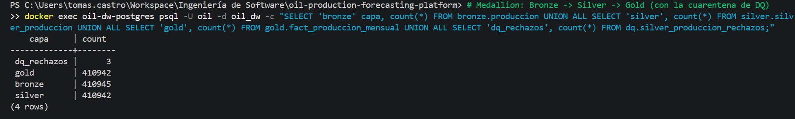

Pipeline **Medallion** en Postgres: Bronze (crudo, 410.945 filas) → Silver (410.942) → Gold. Las
**3 filas de diferencia** son medidas negativas que la **capa de calidad envió a cuarentena**
(`dq_rechazos`) — no se descartan en silencio, quedan auditables.

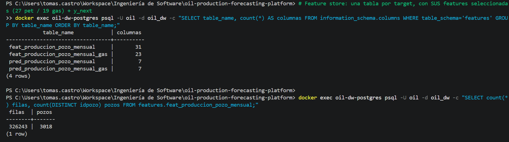

El **feature store**: una tabla por target (petróleo / gas) con las features finales del modelo
(27 / 19 + claves + `y_next`), más las tablas de pronóstico precomputado (`pred_*`).
**Hallazgo clave:** esta misma tabla la consumen **entrenamiento e inferencia** → *cero
training-serving skew* por construcción.

---

## 2. Orquestación (Dagster)

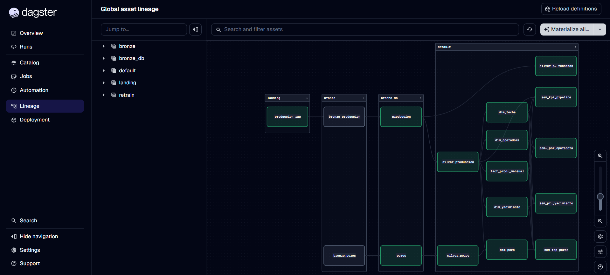

Todo el flujo Bronze → Silver → Gold → capa semántica está orquestado como **grafo de assets**.

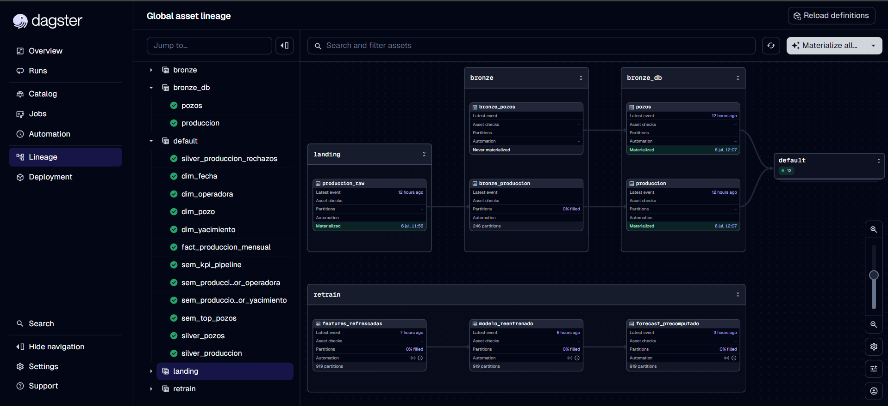

El job de **retrain** (`features_refrescadas → modelo_reentrenado → forecast_precomputado`) está
**particionado por día** y con automatización (Schedule mensual + Sensor por datos nuevos): el
entrenamiento es **recurrente y automático**.

🎥 **[Trigger del retrain en vivo](05_dagster_retrain_trigger.mp4)** — reentrenar "como si fuera
un día dado" con un clic (`--partition`).

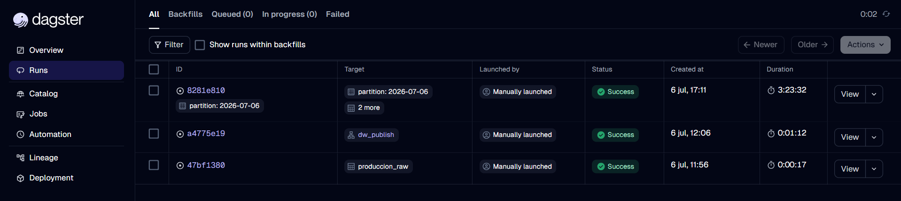
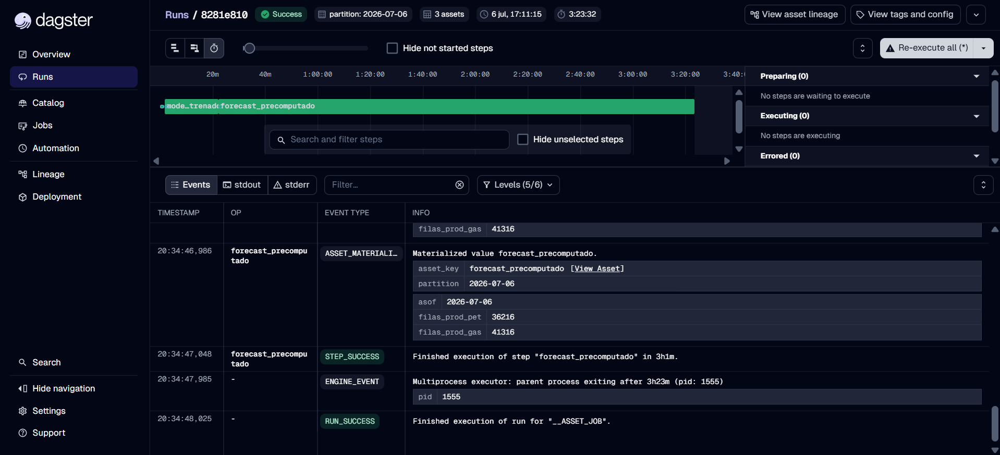

El historial muestra el retrain corriendo por partición (`2026-07-06`) y completando con
éxito: re-materializa el store, reentrena y **regenera el precómputo** (36.216 filas petróleo /
41.316 gas).

---

## 3. Tracking y Model Registry (MLflow)

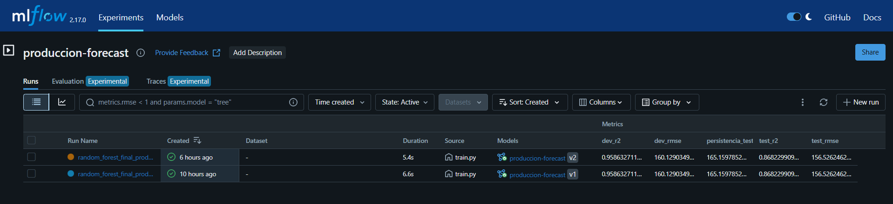

Cada entrenamiento queda **trackeado y es reproducible**: se ven los runs (v1, v2) con sus
métricas. Los dos modelos **superan al baseline de persistencia** (petróleo test RMSE
**156,53** < 165,16; gas **408,20** < 455,72) → cumplen el criterio de éxito.

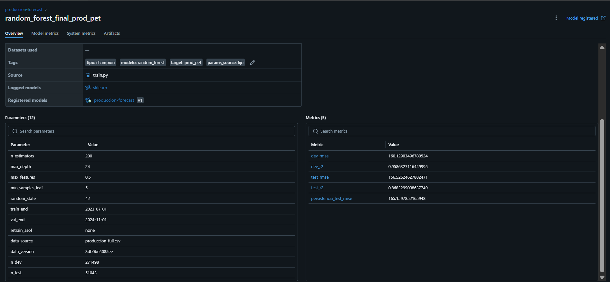

Detalle de un run: **12 hiperparámetros + 5 métricas + versión de datos**, todo logueado para
reproducir la corrida.

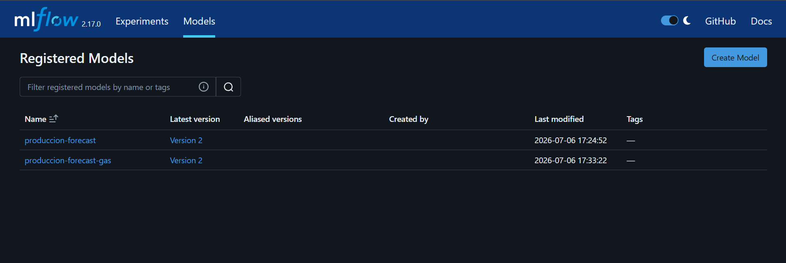

El **model registry**: un modelo por target (`produccion-forecast`, `produccion-forecast-gas`),
versionados.

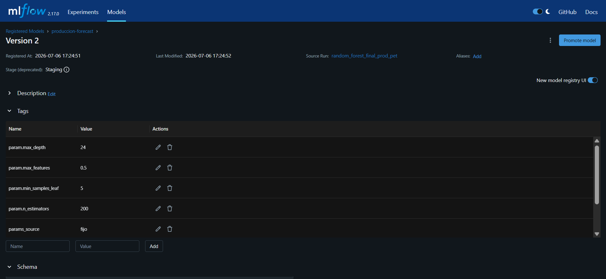

**Hallazgo clave — la puerta de promoción automática funciona:** `v1` está en **Production**,
pero la `v2` que produjo el retrain quedó en **Staging** porque **no mejora al campeón vigente**
(mismo dato → mismo RMSE). No todo retrain pisa Production: la promoción solo ocurre si supera
al modelo actual, protegiendo el serving.

---

## 4. API de inferencia (serving)

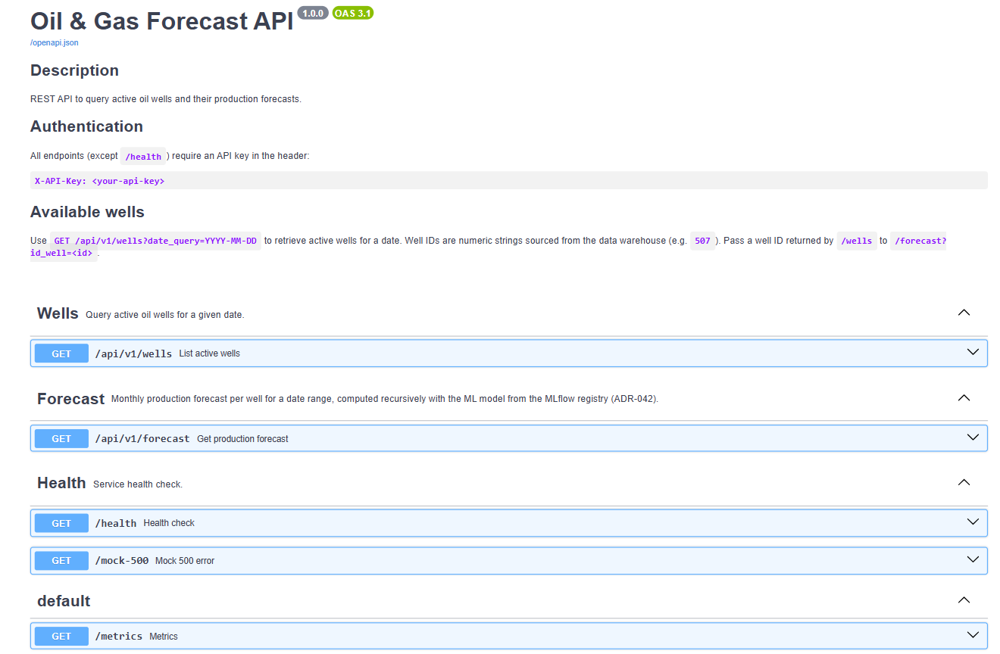

**API REST autodocumentada** (OpenAPI): endpoints, autenticación por API key, contrato del
`/forecast`.

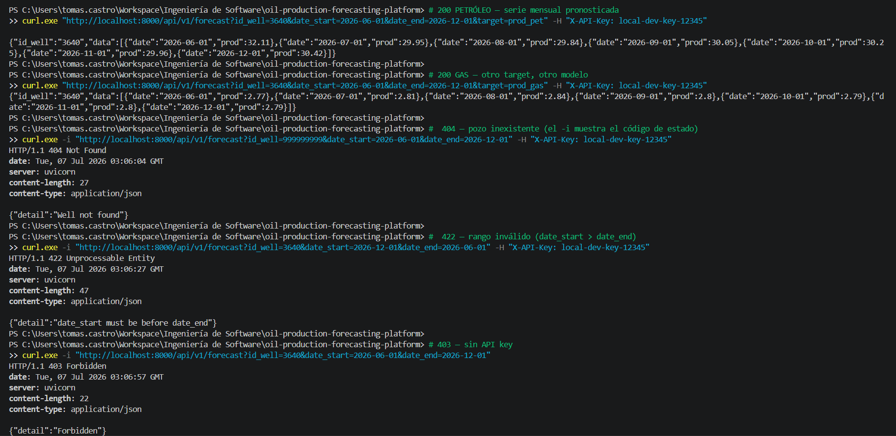

La API **sirviendo pronósticos reales**: petróleo y gas con el mismo endpoint (`?target=`), y
manejo de errores robusto (**404** pozo inexistente, **422** rango inválido, **403** sin API
key). El pronóstico es **recursivo** (predice t+1, realimenta y sigue) y se sirve por **lookup
precomputado**.

---

## Resumen de hallazgos

- **Feature store como fuente única** → entrenamiento e inferencia leen la misma tabla (cero skew).
- **Calidad de datos** con cuarentena auditable (no se descarta en silencio).
- **Entrenamiento orquestado, particionado por día, recurrente y automático** (Dagster).
- **Tracking reproducible** (params + métricas + versión de datos) y **registry** por target.
- **Promoción automática con criterio** (ADR-039): la `v2` del retrain quedó en Staging por no
  superar al campeón — la puerta protege producción.
- **API REST** que sirve pronóstico recursivo de petróleo y gas, con seguridad y manejo de errores.

Todo corriendo en local con Docker; las decisiones clave están justificadas en los ADRs
(`docs/adr/`).
